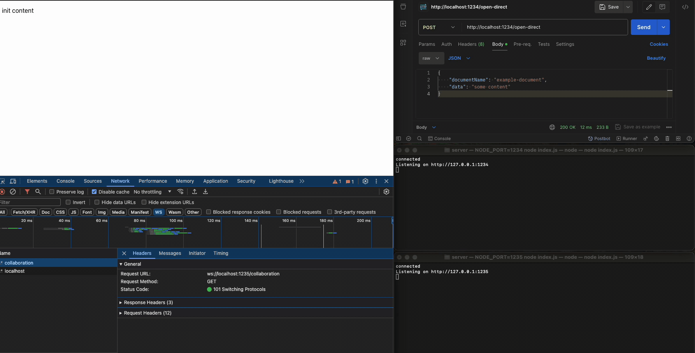

# Reproduction [#800](https://github.com/ueberdosis/hocuspocus/issues/800)

### Engines

##### node: v16.19.0, pnpm v8.15.5

##### Apple M1 14.4 (23E214)

##### Chrome: Mozilla/5.0 (Macintosh; Intel Mac OS X 10_15_7) AppleWebKit/537.36 (KHTML, like Gecko) Chrome/123.0.0.0 Safari/537.36

##### mongodb: v4.4.0

> mongodb://localhost:27017/hocuspocus

##### redis: v7.0.12

> redis://localhost:6379/0

### Start
```sh
# server

# first instance
NODE_PORT=1234 node index.js

# second insance
NODE_PORT=1235 node index.js # tiptap-frontend will be connect `ws://localhost:1235/collaboration`

# tiptap-frontend
pnpm dev
```

### Steps to reproduce the bug

1. start project

2. Access the web page for tiptap-frontend at http://localhost:5173.

> At this moment, the entire project has two Node services corresponding to ports `1234` and `1235`. Both Node services are connected to the `Redis server` on port `6379` and the `Mongo database` on port `27017`. The `web page` connects to the Node service on port `1235`. The document name on the web end is `example-document`.

3. Send requests to the service corresponding to port `1234` to open a `directConnection` on the Node end and append content to the document associated with documentName. Make multiple requests.

```sh
curl -X POST http://localhost:1234/open-direct \
-H "Content-Type: application/json" \
-d "{\"documentName\": \"example-document\", \"data\": \"some content\"}"
```

[demo1.mov](/assets/videos/demo1.mov)

4. It can be observed that the issue of not synchronizing promptly occurred for the second time, and from the fourth time onwards, there were several instances where synchronization was not performed in a timely manner.

### Other
> Additionally, it was found that in the store method of extension-database, if there is a delay before returning Promise.resolve, then the above-mentioned issue of untimely synchronization does not occur, which I find perplexing.


[demo2](/assets/videos/demo2.mov)
